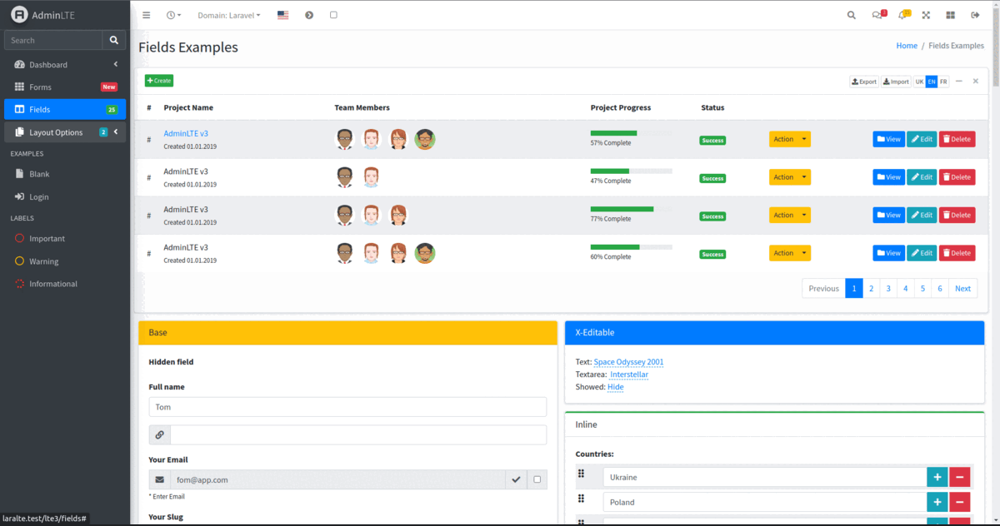

# Admin LTE3 Control Panel for Laravel Framework

[](https://packagist.org/packages/fomvasss/laravel-lte3)
[](https://github.com/fomvasss/laravel-lte3)
[](https://packagist.org/packages/fomvasss/laravel-lte3)
[](https://packagist.org/packages/fomvasss/laravel-lte3)
[](https://scrutinizer-ci.com/g/fomvasss/laravel-lte3)


Create easily and quickly a convenient and functional dashboard for web-site, blogs, shops, crm, apps with the help of a template and a powerful system for building fields and forms.



----------

## Installation

Run from the command line:

```bash
composer require fomvasss/laravel-lte3
```

```bash
php artisan lte3:install
```

That's all. You can usage ITS LTE in your project :) 

Visit the path `http://site.test/lte3/fields` 

## Configuration

After publishing assets, its primary configuration file will be located at `config/lte3.php`

In dashboard used Bootstrap styles and for correct show pagination links, set next in service provider
```
    public function boot()
    {
        //...
        Paginator::useBootstrap();
        //...
    }
```

For correct work navigation in dashboard, apply next middleware for routes to dashboard:
```
\Fomvasss\ItsLte\Http\Middleware\LteRequestOptions::class,
```

## Publishing (optional)
Of course, you can publish only the necessary system components:
- views:
`lte-view-fields`, `lte-view-examples`, `lte-view-auth`, `lte-view-parts`, `lte-view-layouts`
- other:
`lte-config`, `lte-assets`, `lte-lang`

```bash
php artisan lte3:publish --tag=lte-view-fields --force
```
or all components
```bash
php artisan lte3:publish
```

### Updating 
When updating this package, you should re-publish the assets (css, js, images):
```bash
php artisan lte3:publish --tag=lte-assets --force
```

## Structure

After installation, you can work with the following files:

- `config/lte3.php` - package config
- `public/vendor/adminlte` - original AdminLte assets
- `public/vendor/lte3` - assets
- `resources/lang/vendor/lte3` - localization
- `resources/views/vendor/lte3`
    - `layouts`
    - `parts`
    - `components`
    - `auth`
    - `examples`


## Usage & Development

In dir `resources/views/vendor/lte3` you can edit, create, delete blade-files.

For file manage use [laravel-medialibrary-extension](https://github.com/fomvasss/laravel-medialibrary-extension)
For manage taxonomy use [laravel-simple-taxonomy](https://github.com/fomvasss/laravel-simple-taxonomy)
For save vars, configs use [laravel-variables](https://github.com/fomvasss/laravel-variables)


## Addition

### Laravel CKEditor (v4)

See: [CKEditor](https://github.com/UniSharp/laravel-ckeditor)

### Laravel File Manager (v2)   

See: [LFM](https://github.com/UniSharp/laravel-filemanager):

```bash
composer require unisharp/laravel-filemanager
```

Publish LFM files: `config/lfm.php`, `public/vendor/laravel-filemanager`:

```bash
php artisan vendor:publish --tag=lfm_config
php artisan vendor:publish --tag=lfm_public
```
Recommend set LFM paths `config/lfm.php`:

```php
    'shared_folder_name' => 'shares',
    //...
    'folder_categories' => [
        'file' => [
            'folder_name' => 'lfm-files',
            //...
        ],
        'image' => [
            'folder_name' => 'lfm-photos',
            //...
        ],      
    ],
```

## Credits
- [ColorlibHQ/AdminLTE2](https://adminlte.io/themes/AdminLTE/)
- [ColorlibHQ/AdminLTE3](https://adminlte.io/themes/v3/)
- [fomvasss/laravel-lte3](https://github.com/fomvasss/laravel-lte3)
- [web-west/itslte](https://github.com/web-west/itslte)
- [laravel-filemanager](https://unisharp.github.io/laravel-filemanager/)
