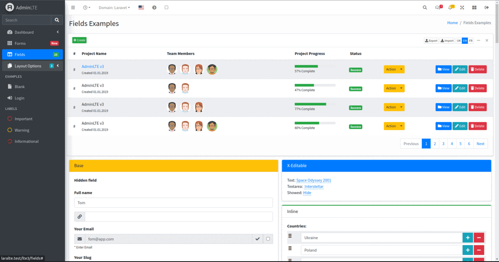

# Admin LTE3 Control Panel for Laravel Framework

[](https://packagist.org/packages/fomvasss/laravel-lte3)
[](https://github.com/fomvasss/laravel-lte3)
[](https://packagist.org/packages/fomvasss/laravel-lte3)
[](https://packagist.org/packages/fomvasss/laravel-lte3)

Create easily and quickly a convenient and functional dashboard for web-site, blogs, shops, crm, apps with the help of a template and a powerful system for building fields and forms.
To learn all about it, head over to [the extensive documentation](https://fomvasss.github.io/laravel-lte3-docs/).



----------


## Installation

Run:

```bash
composer require fomvasss/laravel-lte3

composer require almasaeed2010/adminlte --dev

php artisan vendor:publish --tag=lte3-config

php artisan lte3:install
```

That's all. You can usage LTE3 in your project :)


All examples of fields and components can be viewed: `http://site.test/lte3/exsmples` (`.../examples/components.vlade.php`)


## Configuration

Configuration file: `config/lte3.php`

- `view.compact` (bool, default `true`) - compact size for main-header and sidebar (adds `text-sm` to the header/brand-link and `nav-compact` to the sidebar menu)
- `view.pattern_validation.validate_on_load` (bool, default `false`) - check prefilled values of fields with `pattern` on page load. A saved value that does not match blocks form submit until it is fixed
- `view.pattern_validation.message` (string, default `Format is not valid.`) - default error text for fields with `pattern`

For correct work navigation in dashboard, apply middleware. Add this to `App\Http\Kernel.php`:

```
$middlewareGroups = [
  'web' => [
    //...
    \Fomvasss\Lte3\Http\Middleware\LteRequestOptions::class,
  ],
];
```

### Pattern validation

Fields with the `pattern` attribute (`input` and `textarea`) are validated live, while typing:

- the value must match the pattern entirely, like the native browser check — `\d{5}` does not accept `abc12345xyz`
- the pattern is case-sensitive and compiled with the `v` flag (falls back to `u` and to no flags for patterns that are invalid in `v` mode, e.g. an unescaped `-` in a character class)
- empty value is not checked — combine with `required` if the field is mandatory
- an invalid field gets `is-invalid` and blocks form submit
- fields added after page load (mb-blocks, AJAX modals) are covered automatically, no re-init needed

Custom error text per field — `data-pattern-message`:

```php
{!! Lte3::text('options[smtp_host]', null, [
    'label' => 'SMTP host',
    'pattern' => '^[A-Za-z0-9.\\-]+$',
    'data' => ['pattern-message' => 'Host only, without https:// and port'],
]) !!}
```

### Extra hidden fields in forms

`Lte3::formHiddenUsing()` adds hidden fields to every non-GET form opened by `Lte3::formOpen()`. The resolver is called on each form render and returns `[name => value]`; fields with `null` or `''` value are skipped. Register it once, e.g. in `AppServiceProvider::boot()`.

Typical case — the content locale of the admin panel is stored in the session, shared by all browser tabs. A form opened in one locale and saved after the session was switched to another one (another tab, browser "back", locale switcher) writes the text into the wrong translation. Send the locale the form was opened with, and let the middleware that reads the locale from the request apply it:

```php
Lte3::formHiddenUsing(fn () => ['sLocale' => session('sLocale')]);
```

The resolver receives the form model (`model` of `formOpen()`, or `null`) and the `formOpen()` attributes, so fields can depend on the edited record. E.g. a fingerprint of the record, to reject a save over changes made by someone else after the form was opened:

```php
Lte3::formHiddenUsing(fn ($model, array $attrs) => [
    '_edit_fingerprint' => $model?->editFingerprint(),
]);
```

If you have published or copied `components/form.blade.php`, render the `$hidden` variable next to `_token`.

## Publishing (optional)

This package require dev `almasaeed2010/adminlte` package.
If you chose the option to create a symbolic link (when installing) to `adminlte` resources,
then the `almasaeed2010/adminlte` dependency must be included in your composer:

```bash
composer require almasaeed2010/adminlte
```
If you publish all `almasaeed2010/adminlte` resources to the public,
then the unused packages (`public/vendor/adminlte/plugins/...`) can be
manually cleaned so as not to take up disk space.


Of course, you can published partial for customize:

- views:
`lte3-view-components`, `lte3-view-examples`, `lte3-view-auth`, `lte3-view-parts`, `lte3-view-layouts`

- other:
`lte-config`, `lte-assets`, `lte-lang`

For Example:

```bash
php artisan vendor:publish --tag=lte3-view-components
```


## Structure

- `config/lte3.php` - package config
- `public/vendor/adminlte` - original AdminLte assets (css, js, plugins) [ColorlibHQ/AdminLTE3](https://adminlte.io/themes/v3/)
- `public/vendor/lte3` - custom assets (you can change this)
- `resources/views/vendor/lte3` - optional publishing
  - `auth`
  - `layouts`
  - `parts`
  - `components`
  - `examples`


## Usage & Development

See [examples.blade.php](https://github.com/fomvasss/laravel-lte3/blob/master/resources/views/examples/components.blade.php)


## Recommended

- For file manage use [laravel-medialibrary-extension](https://github.com/fomvasss/laravel-medialibrary-extension)
- For manage taxonomy use [laravel-simple-taxonomy](https://github.com/fomvasss/laravel-simple-taxonomy)
- For save vars, configs use [laravel-variables](https://github.com/fomvasss/laravel-variables)
- Text Editor: [CKEditor](https://github.com/UniSharp/laravel-ckeditor)
- File manager: [LFM](https://github.com/UniSharp/laravel-filemanager):


## Credits
- [ColorlibHQ/AdminLTE2](https://adminlte.io/themes/AdminLTE/)
- [ColorlibHQ/AdminLTE3](https://adminlte.io/themes/v3/)
- [fomvasss/laravel-its-lte](https://github.com/fomvasss/laravel-its-lte)
- [web-west/itslte](https://github.com/web-west/itslte)
- [laravelcollective](https://laravelcollective.com/docs/6.x/html)
