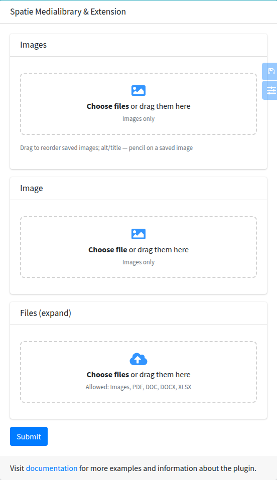

# mediaFile, mediaImage

Files of a [Spatie MediaLibrary](https://spatie.be/docs/laravel-medialibrary) collection: drop zone, previews of picked files before saving, thumbnails, delete with restore, drag-and-drop sorting, file properties (alt, title, ...) in a modal and an optional main file. The form fields are made for [fomvasss/laravel-medialibrary-extension](https://github.com/fomvasss/laravel-medialibrary-extension): the controller saves everything with `$model->mediaManage($request)`.



`mediaImage` is the same component for images: a thumbnail grid instead of a file list, `accept="image/*"`.

## Signature

```php
Lte3::mediaFile(string $name, ?HasMedia $model = null, array $attrs = [])
Lte3::mediaImage(string $name, ?HasMedia $model = null, array $attrs = [])
```

| Component | Config `default` |
| --- | --- |
| `mediaFile` | - |
| `mediaImage` | `['is_image' => true, 'accept' => 'image/*']` |

`$model` is the model whose media are shown. When it is `null`, the model of `Lte3::formOpen(['model' => ...])` is used; without both (a create form) the field shows no saved files. A model that doesn't implement `Spatie\MediaLibrary\HasMedia` is reported inside the field.

## Basic example

```blade
{!! Lte3::formOpen(['action' => route('admin.articles.update', $article), 'method' => 'PUT', 'model' => $article, 'files' => true]) !!}

{!! Lte3::mediaImage('images', $article, [
    'label' => 'Gallery',
    'multiple' => true,
    'custom_properties' => ['alt', 'title'],
]) !!}

{!! Lte3::mediaImage('image', $article, [
    'label' => 'Cover',
    'custom_properties' => ['alt' => 'Alt text'],
]) !!}

{!! Lte3::mediaFile('files', $article, [
    'label' => 'Documents',
    'multiple' => true,
    'accept' => '.pdf,.doc,.docx,.xlsx',
]) !!}

{!! Lte3::btnSubmit('Save') !!}
{!! Lte3::formClose() !!}
```

```php
public function update(ArticleRequest $request, Article $article)
{
    $article->update($request->validated());
    $article->mediaManage($request);

    return back();
}
```

The model, with collections `image` (single) and `images`, `files` (multiple):

```php
use Fomvasss\MediaLibraryExtension\HasMedia\HasMedia;
use Fomvasss\MediaLibraryExtension\HasMedia\InteractsWithMedia;

class Article extends Model implements HasMedia
{
    use InteractsWithMedia;

    protected $mediaSingleCollections = ['image'];

    protected $mediaMultipleCollections = ['images', 'files'];
}
```

`mediaManage()` reads the request fields named after each collection, so the field `name` must be the collection name. Collections that are not listed in the model are not saved.

## Attrs

| Attr | Type | Default | Description |
| --- | --- | --- | --- |
| `multiple` | bool | `false` | Several files. Without it the field holds one file and a new file replaces the saved one. Should match the collection type in the model. |
| `is_image` | bool | `false` (`true` for `mediaImage`) | Thumbnail grid instead of a list. |
| `accept` | string | `image/*` with `is_image` | Allowed types, as in `<input type="file">`. Shown under the drop zone in words; other files are not added. |
| `custom_properties` | array | `[]` | Editable file properties, see [Properties](#properties). |
| `format` | string | `lte3.view.media.format` (`legacy`) | `legacy` or `expand`, see [Formats](#formats-legacy-and-expand). |
| `main` | bool | `false` | Star to mark the main file. Only `expand` + `multiple`. |
| `thumb_size` | int | `lte3.view.media.thumb_size` (110) | Minimal width of an image tile in the grid, px. |
| `collection` | string | `name` | Collection whose saved files are shown. Field names are still built from `name`. |
| `name_deleted` | string | `{name}_deleted` | `legacy`: name of the delete inputs. |
| `name_weight` | string | `{name}_weight` | `legacy`: name of the order inputs. |
| `name_custom` | string | `{name}_custom` | `legacy`: name of the property inputs. |
| `label` | string | `Str::studly($name)` | Card title HTML. `''` hides the card header. |
| `help` | string | - | Help HTML under the drop zone. |
| `class` | string | - | Extra classes of the file input. |
| `class_wrap` | string | - | Extra classes of the wrapper card. |
| `disabled` | bool | `false` | Disables the drop zone (no new files). |

`field_attrs` keys (`required`, `id`, `data-name`, ...) are not rendered by this component.

> [!NOTE]
> `name_deleted`, `name_weight` and `name_custom` only rename the fields. `mediaManage()` reads `{collection}_deleted`, `_weight`, `_custom` (suffixes from `media-library-extension.field_suffixes`), so change them only with your own saving code.

## Formats: legacy and expand

| | `legacy` (default) | `expand` |
| --- | --- | --- |
| Fields | `name[]` / `name`, `name_deleted`, `name_weight[id]`, `name_custom[id][prop]` | a row per file: `name[N][id]` or `name[N][file]`, `[weight]`, `[delete]`, `[is_main]`, `[<property>]` |
| Order | saved files; new ones are added at the end | all files, new ones included |
| Properties of new files | single field only (`name_custom[new][prop]`) | yes |
| Main file (`main`) | no | yes |
| Properties written by `mediaManage()` | any | only `media-library-extension.expand.allowed_custom_properties` |
| Extension version | any with the simple format | 6.4.1+ (for a collection named `files`, `query`, `request`, ...) |

`legacy` keeps the fields of the field before 1.121. Use `expand` where you need properties or order of new files, or the main file. Per field:

```blade
{!! Lte3::mediaFile('files', $article, [
    'multiple' => true,
    'format' => 'expand',
    'main' => true,
    'custom_properties' => ['alt', 'title'],
]) !!}
```

Or for the whole project:

```php
// config/lte3.php
'view' => [
    'media' => [
        'format' => 'expand',
    ],
],
```

With `expand`, a property not listed in `media-library-extension.expand.allowed_custom_properties` (default `alt`, `title`) is not saved; the field shows a warning with its name.

> [!WARNING]
> In `expand`, `mediaManage()` sets `is_main` and `is_active` on every submitted row: `is_main` from the row (`false` when it is not sent) and `is_active` to `true`. A field without `main` therefore resets the main flag of its collection on save, and a file hidden with `is_active = 0` elsewhere becomes active again.

### What is submitted: legacy

Multiple, `Lte3::mediaImage('images', $article, ['multiple' => true, 'custom_properties' => ['alt']])` with saved media 13 and 15:

| Field | Value |
| --- | --- |
| `images[]` | new files |
| `images_deleted[]` | one per saved file: `''` or the media id to delete |
| `images_weight[13]`, `images_weight[15]` | positions of saved files |
| `images_custom[13][alt]`, `images_custom[15][alt]` | properties of saved files |

Single, `Lte3::mediaImage('image', $article, ['custom_properties' => ['alt']])` with saved media 7:

| Field | Value |
| --- | --- |
| `image` | the new file; the extension deletes the old one |
| `image_deleted` | `''` or `7` |
| `image_custom[7][alt]` | property of the saved file |
| `image_custom[new][alt]` | property of the new file |

When a new file is picked in a single field, the inputs of the saved file are disabled and not sent.

### What is submitted: expand

Multiple, `Lte3::mediaFile('files', $article, ['multiple' => true, 'format' => 'expand', 'main' => true, 'custom_properties' => ['title']])`:

| Field | Value |
| --- | --- |
| `files[0][id]` | `13` (saved file) |
| `files[0][delete]` | `0` or `1` |
| `files[0][weight]` | position on screen |
| `files[0][is_main]` | `0` or `1` |
| `files[0][title]` | property |
| `files[2][file]` | new file (`UploadedFile`) |
| `files[2][weight]`, `files[2][is_main]`, `files[2][title]` | same keys for the new file |

Saved files take indexes `0..n-1`, new files continue from `n`; a removed new file leaves a gap. Single field: one row without an index, `image[id]`, `image[delete]`, `image[<property>]` for the saved file or `image[file]`, `image[<property>]` for a new one.

### Validation

In `legacy`, `name.*` is a file:

```php
'images' => ['nullable', 'array'],
'images.*' => ['image', 'max:10240'],
'image' => ['nullable', 'image', 'max:10240'],
```

In `expand`, `name.*` is an array and the file is in `name.*.file`; a rule `'files.*' => 'file'` rejects the whole form. A rule that accepts both formats:

```php
use Illuminate\Validation\Rule;

'files' => ['nullable', 'array'],
'files.*' => Rule::forEach(fn ($value) => is_array($value) ? ['array'] : ['file', 'max:51200', 'mimes:jpg,png,pdf']),
'files.*.file' => ['nullable', 'file', 'max:51200', 'mimes:jpg,png,pdf'],
```

A single `expand` field: `'image' => ['nullable', 'array']`, `'image.file' => ['nullable', 'image', 'max:10240']`.

## Properties

`custom_properties` takes fields in the [`Lte3::field()`](overview.md) format:

```blade
'custom_properties' => ['alt', 'title'],

'custom_properties' => ['alt' => 'Alt text', 'title' => 'Title'],

'custom_properties' => [
    ['name' => 'alt', 'label' => 'Alt text'],
    ['name' => 'caption', 'label' => 'Caption', 'type' => 'textarea', 'rows' => 3],
],
```

A label not given is `__(Str::ucfirst($name))` (`Alt`, `Title`). Every file gets a pencil button; it opens a modal with a preview and the fields (any type `Lte3::field()` renders). Values are written into hidden inputs of the file row and saved with the form, into the media `custom_properties` (`$media->getCustomProperty('alt')`).

The first filled property is shown under the file name. With an `alt` property, an image without alt is marked "No alt". In `legacy` with `multiple`, new files have no pencil: their properties can't be sent before they have an id.

## Main file

With `format => expand`, `multiple` and `main => true`, every file has a star. Only one file can be the main one; it is sent as `is_main = 1`, and the extension resets `is_main` of the other media of the collection. The flag is the `is_main` column added by the extension migration.

```php
$cover = $article->getMedia('files')->firstWhere('is_main', true);
```

## Order and deletion

- **Order**: in a multiple field files are sorted by dragging (grid in both directions, list by the handle). The position is written into the weight inputs; the extension saves it to `order_column`. In `legacy` only saved files can be moved, new files stay at the end.
- **Delete** a saved file marks it "Will be deleted" with a Restore button; the delete flag is sent with the form. A new (not saved) file is removed from the form at once.
- **Single field**: while it has a file, the drop zone is hidden and the file has a Replace button. A newly picked file hides the saved one; removing the new file brings the saved one back.

## Thumbnails

Image thumbnails of saved media come from `MediaThumbUrlResolver::resolve($media, $thumbSize)` with the driver from `lte3.view.media.thumb`:

| Driver | Thumbnail |
| --- | --- |
| `conversion` (default) | `$media->getUrl('thumb')` (`conversion_name`); the original while the conversion is not generated yet. |
| `imagepreset` | `imagepreset_url()` with `imagepreset_params`, size `2 × thumb_size`. |
| callable | `fn (Media $media, ?int $size): string`. |

Picked files are previewed in the browser before upload. Driver details and setup: [Media thumbnails](../usage/media-thumbnails.md).

`thumb_size` (attr) or `lte3.view.media.thumb_size` (config, 110) sets the minimal tile width of the grid.

## JS behaviour

- Behaviour is in `main.js`, styles in `main.css`. Click, drop, delete, properties and star handlers are delegated; `initMediaFile(root)` sets up sorting and the state of the fields inside `root`. It runs on page load and is registered in the automatic init of [dynamic content](../usage/dynamic-content.md), so fields in AJAX modals and repeater items need no `data-fn-inits`.
- Every picked file is moved into its own `<input type="file">` of the row (`DataTransfer`), and the form is sent by a regular submit. The form must be `multipart/form-data` (`'files' => true`).
- The properties modal is moved to `<body>` when it is opened the first time. Its own inputs (`f_media_prop[...]`) only edit the row values; until the modal has been opened they are inside the form and are submitted too, so ignore `f_media_prop` in the request.
- Sorting needs jQuery UI sortable (included in the package layout).

If lte3 assets are published as a copy instead of a symlink, publish them again after an update. The layout loads `main.js` / `main.css` through `lte3_asset()`, which adds a version parameter. A published or copied `components/mediaFile.blade.php` keeps the old UI (before 1.121).

## Translations

Texts are English through `__()`. Add the keys to `lang/<locale>.json`:

```json
{
    "Choose file": "Оберіть файл",
    "Choose files": "Оберіть файли",
    "or drag them here": "або перетягніть сюди",
    "Images only": "Лише зображення",
    "Allowed: :types": "Дозволено: :types",
    "Not allowed: :files.": "Не підходить: :files.",
    "Images": "Зображення",
    "Video": "Відео",
    "Audio": "Аудіо",
    "New": "Новий",
    "Remove": "Прибрати",
    "Delete": "Видалити",
    "Restore": "Відновити",
    "Replace": "Замінити",
    "Download": "Завантажити",
    "Edit": "Редагувати",
    "Main": "Головне",
    "Drag to reorder": "Перетягніть, щоб змінити порядок",
    "Will be deleted": "Буде видалено",
    "No alt": "Немає alt",
    "Cancel": "Скасувати",
    "Done": "Готово"
}
```

Property labels without `label` are translated too (`Alt`, `Title`).
