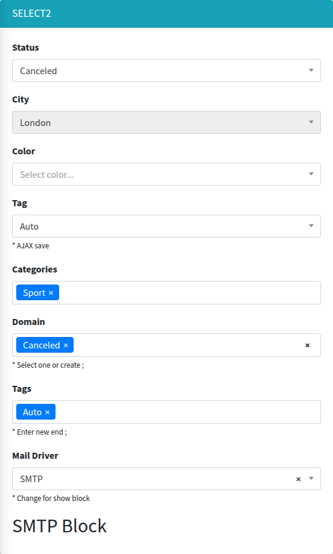

# select2

A dropdown based on [Select2](https://select2.org/) 4.0: single or multiple choice, AJAX search, tags with creation of new values, AJAX save on change and toggling of page blocks.



## Signature

```php
Lte3::select2(string $name, mixed $selected = null, array $options = [], array $attrs = [])
```

## Basic example

```blade
{!! Lte3::select2('status', 'canceled', [
    'new' => 'New',
    'pending' => 'Pending',
    'canceled' => 'Canceled',
], [
    'label' => 'Status',
    'disableds' => ['pending'],
]) !!}

{!! Lte3::select2('color', null, ['Green', 'Red', 'White'], [
    'label' => 'Color',
    'empty_value' => '--',
    'placeholder' => 'Select color...',
]) !!}

{!! Lte3::select2('categories', $post->categories->pluck('id')->all(), $categories->pluck('name', 'id')->all(), [
    'label' => 'Categories',
    'multiple' => true,
]) !!}
```

## Options

`$options` is a plain PHP array (convert Collections with `->pluck('name', 'id')->all()`). Three forms are supported:

| Form | Example | Option value | Option text |
| --- | --- | --- | --- |
| Associative | `['new' => 'New']` | the key | the value |
| List of strings | `['Green', 'Red']` | lowercased string (`green`) | string with the first letter uppercased (`Green`) |
| Arrays | `[['id' => 3, 'name' => 'Sport']]` | first of `id`, `slug`, `key`, `value`, otherwise the key | first of `label`, `name`, `title`, otherwise the key |

An array that mixes forms (`[['id' => 'night', ...], 'day' => 'Day', 'evening']`) counts as associative: scalar elements use their key as the value.

## Selected values

Resolved in the component view, not by the common [Value resolution](overview.md#value-resolution):

1. `$selected`, if not `null`.
2. Otherwise the form model attribute `$model->{$name}`, if `Lte3::formOpen(['model' => ...])` is open.
3. Otherwise `old($name)`.
4. Otherwise the `default` attr.

The result is wrapped into an array and merged with `old($name)` (old values win). An option is selected when its value is in this array (loose `in_array`, so `3` matches `'3'`).

`request()` and `getFormValue()` are not used, and the model lookup reads the attribute by the literal field name. For a relation, pass the ids explicitly: `$post->categories->pluck('id')->all()`. A Collection passed as `$selected` is not unwrapped.

## Attrs

| Attr | Type | Default | Description |
| --- | --- | --- | --- |
| `label` | string | `Str::studly($name)` | Label HTML. `''` hides it. |
| `help` | string | - | Help HTML under the field. |
| `default` | mixed | - | Selected value(s) when there is no `$selected`, model and old input. |
| `multiple` | bool | `false` | Multiple choice; the name gets `[]`. See `max`. |
| `max` | int | - | With `url_tags`: maximum number of selected tags. `1` with `multiple` submits a scalar (`name` without `[]`). |
| `empty_value` | string | - | Adds a first option with value `''` and this text (single select only) and enables the clear button. |
| `placeholder` | string | - | Select2 placeholder. For a single select it shows only together with an empty option (`empty_value`). |
| `allowClear` | bool | `false` | Shows the clear button (`x`). |
| `disableds` | array | `[]` | Option values to disable. |
| `disabled` | bool | `false` | Disables the select. |
| `class` | string | - | Extra classes of the `<select>`. |
| `class_wrap` | string | - | Extra classes of the wrapper `.form-group.f-select2-wrap`. |
| `hidden_wrap` | bool | `false` | Hides the whole field. |
| `id` | string | name (with `[]` for multiple) | `id` of the `<select>`. The label `for` always uses the name. |
| `data` | array | - | `data-*` attributes of the `<select>`. |
| `map` | array | - | Shows and hides page blocks by the selected value, see [Toggle blocks](#toggle-blocks). |
| `url_suggest` | string | - | Loads options by AJAX while typing, see [AJAX search](#ajax-search). |
| `url_tags` | string | - | Tags mode: AJAX options plus new values typed by the user, see [Tags](#tags). |
| `separators` | string | `[",", ";"]` | With `url_tags`: JSON array of characters that finish a tag. |
| `new_tag_label` | string | ` (new)` | With `url_tags`: suffix shown after a not yet existing tag in the dropdown. |
| `url_save` | string | - | Saves the value by AJAX on change, see [AJAX save](#ajax-save). |
| `method_save` | string | `POST` | HTTP method of the AJAX save. |
| `attrs` | array | `[]` | Extra HTML attributes of the `<select>`. |

`field_attrs` keys (`required`, `placeholder`, `x-model`, ...) are printed on the `<select>`.

Automatic behaviour:

- Five or fewer options (and no `url_suggest`): the search box in the dropdown is hidden.
- More than six options, single select without `empty_value`: a disabled ` ---` option is added on top, so nothing looks selected until the user chooses.

## What is submitted

- Single: `name=value`.
- Multiple: `name[]=value1&name[]=value2`, i.e. an array. Nothing selected sends nothing, so the key is missing; use `$request->input('categories', [])`.

## Toggle blocks

`map` links option values to CSS selectors. The blocks of the selected value are shown, the blocks of other values are hidden, on page load and on every change:

```blade
{!! Lte3::select2('driver', 'smtp', ['log' => 'Log', 'smtp' => 'SMTP', 'sendmail' => 'Mail'], [
    'label' => 'Mail Driver',
    'map' => [
        'smtp' => ['.block-smtp'],
        'log' => ['.block-log', '.block-log-sendmail'],
        'sendmail' => ['.block-sendmail', '.block-log-sendmail'],
    ],
]) !!}

<div class="block-smtp" style="display: none;">SMTP settings</div>
<div class="block-log" style="display: none;">Log settings</div>
<div class="block-sendmail" style="display: none;">Sendmail settings</div>
<div class="block-log-sendmail" style="display: none;">Common for Log and Sendmail</div>
```

A selector can belong to several values. Hidden blocks are still submitted with the form. Works for single selects only (the first selected value is used).

## AJAX search

With `url_suggest`, options are loaded from the server while the user types. Render the currently selected items as `$options`, otherwise they are not shown:

```blade
{!! Lte3::select2('user_id', $order->user_id, $order->user ? [$order->user->id => $order->user->name] : [], [
    'label' => 'Customer',
    'url_suggest' => route('admin.users.suggest'),
    'empty_value' => '',
    'placeholder' => 'Search...',
]) !!}
```

Request: `GET {url_suggest}?term=...&q=...&_type=query` (Select2 defaults; `term` and `q` hold the same search string, `page` is added when paginating).

Response:

```json
{
    "results": [
        {"id": 1, "text": "Pending"},
        {"id": 2, "text": "Canceled"}
    ],
    "pagination": {"more": false}
}
```

`pagination` is optional. Filtering is the server's job:

```php
public function suggest(Request $request)
{
    $users = User::where('name', 'like', '%' . $request->input('term') . '%')->limit(20)->get();

    return response()->json([
        'results' => $users->map(fn ($u) => ['id' => $u->id, 'text' => $u->name]),
    ]);
}
```

## Tags

With `url_tags`, the dropdown shows options from the server (same request and response as [AJAX search](#ajax-search)) and also lets the user create new values by typing. A tag is finished by Enter or by a separator character.

```blade
{!! Lte3::select2('tags', $post->tags->pluck('id')->all(), $post->tags->pluck('name', 'id')->all(), [
    'label' => 'Tags',
    'multiple' => true,
    'url_tags' => route('admin.tags.suggest'),
    'separators' => '[";"]',
    'new_tag_label' => ' [NEW]',
    'max' => 4,
]) !!}
```

- A new tag is submitted as its typed text (`id` = text), existing ones as their `id`. The server has to tell them apart, e.g. by `is_numeric()` or by looking the value up.
- `max` limits the number of tags (Select2 `maximumSelectionLength`).
- `separators` is parsed by jQuery as JSON, so use double quotes inside: `'[";", ","]'`.

```php
$ids = collect($request->input('tags', []))
    ->map(fn ($v) => ctype_digit((string) $v) ? (int) $v : Tag::firstOrCreate(['name' => $v])->id)
    ->all();
```

## AJAX save

With `url_save`, every change sends the value right away, without submitting the form:

```blade
{!! Lte3::select2('status', $order->status, $statuses, [
    'label' => '',
    'url_save' => route('admin.orders.update-field', $order),
]) !!}
```

Request: `{method_save}` (`POST` by default) to `url_save` with

- `name` — the field name without `[]`;
- `value` — the selected value; for a multiple select an array `value[]`, and no `value` key when nothing is selected.

Response (JSON):

```json
{"message": "Status saved", "operation": "reload"}
```

- `message` — shown as a success toast, if present.
- `operation: "reload"` — reloads the page.
- HTTP error — an error toast.

`url_save` can be combined with `url_suggest` or `url_tags`.

## JS behaviour

- Init: `initSelect2(root)` on `.f-select2` elements, called on page load and for content inserted later (modals, mb-blocks, `.js-ajax-send` responses), see [Dynamic content](../usage/dynamic-content.md). Already initialized selects are skipped; to apply new options call `.select2('destroy')` first.
- The dropdown is attached to the field wrapper (`dropdownParent`), so it works inside Bootstrap modals.
- Every select gets a unique `data-select2-id`, so a field with the same `id` on the page and in a modal do not break each other.
- The UI language comes from `<html lang>`.
- Data attributes: `data-url-suggest`, `data-url-tags`, `data-url-save`, `data-method-save`, `data-max`, `data-separators`, `data-new-tag-label`, `data-map`, `data-name`.

See [JavaScript API](../reference/javascript.md).

## Related

- [select2Tree](select2Tree.md) — select2 with a hierarchical options tree.
- [radiogroup](radiogroup.md) — the same `map` for radio buttons.
