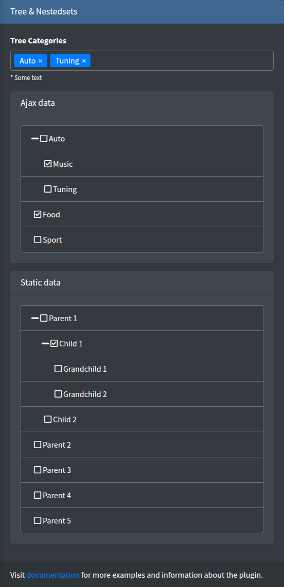

# select2Tree

A select2 dropdown with a hierarchical (collapsible) options tree loaded by AJAX, based on [select2-to-tree](https://github.com/clivezhg/select2-to-tree).



## Signature

```php
Lte3::select2Tree(string $name, array $attrs = [])
```

The component has no value or options arguments: both the tree and the selected values come from the `url_tree` endpoint.

## Basic example

```blade
{!! Lte3::select2Tree('category_id', [
    'label' => 'Category',
    'url_tree' => route('admin.categories.tree', ['selected' => [$product->category_id]]),
]) !!}

{!! Lte3::select2Tree('category_ids', [
    'label' => 'Categories',
    'multiple' => true,
    'required' => true,
    'method_get' => 'POST',
    'expand_all' => true,
    'url_tree' => route('admin.categories.tree', ['selected' => $product->categories->pluck('id')->all()]),
]) !!}
```

## Attrs

| Attr | Type | Default | Description |
| --- | --- | --- | --- |
| `url_tree` | string | - | Endpoint returning the tree and the selected values, see [Endpoint](#endpoint). Required. |
| `method_get` | string | `GET` | HTTP method of the tree request. |
| `multiple` | bool | `false` | Multiple choice; the name gets `[]`. |
| `expand_all` | bool | `true` | Expands all branches when the dropdown opens. `false` shows them collapsed. |
| `label` | string | `Str::studly($name)` | Label HTML. `''` hides it. |
| `help` | string | - | Help HTML under the field. |
| `class` | string | - | Extra classes of the `<select>`. |
| `class_wrap` | string | - | Extra classes of the wrapper `.form-group.f-select2-tree-wrap`. |
| `hidden_wrap` | bool | `false` | Hides the whole field. |
| `attrs` | array | `[]` | Extra HTML attributes of the `<select>`. |

`field_attrs` keys (`required`, `id`, ...) are printed on the `<select>`.

## Endpoint

On init the field sends one AJAX request:

- Method: `method_get` (`GET` by default). With `POST` the CSRF header from the layout is sent.
- URL: `url_tree` as given, plus a `data=` parameter. Pass the selected ids in the URL query, as in the examples above.

Response (JSON):

```json
{
    "data": [
        {"id": 1, "name": "Auto", "children": [
            {"id": 2, "name": "Music", "children": []},
            {"id": 3, "name": "Tuning", "children": []}
        ]},
        {"id": 4, "name": "Food", "children": []}
    ],
    "selected": [1, 3]
}
```

- `data` (or `result`) — the tree. Every node has `id` (option value), `name` (option text) and `children` (array of nodes). These field names are fixed.
- `selected` (or `default`) — the value or array of values to select.

A minimal controller, as in the package example (`ExampleController::treeselect`):

```php
public function tree(Request $request)
{
    return response()->json([
        'data' => Category::get()->toTree()->toArray(),
        'selected' => $request->input('selected', []),
    ]);
}
```

`toTree()` comes from `kalnoy/nestedset`; any array of `id`/`name`/`children` nodes works.

## What is submitted

- Single: `name=id`.
- Multiple: `name[]=id1&name[]=id2`. Nothing selected sends nothing.

The form model, `old()` and `default` are not used: after a failed validation the field shows what the endpoint returns, so pass `old()` into the URL if the choice must survive it:

```blade
'url_tree' => route('admin.categories.tree', ['selected' => old('category_ids', $product->categories->pluck('id')->all())]),
```

## JS behaviour

- Init: `initSelect2Tree(root)` on `.f-select2-tree-wrap`, on page load and for content inserted later, see [Dynamic content](../usage/dynamic-content.md). Each field is initialized once.
- On a failed request an error toast `Error Tree Ajax!` is shown.
- Data attributes on the `<select>`: `data-url`, `data-method-get`, `data-expandAll`, `data-valFld="id"`, `data-labelFld="name"`, `data-incFld="children"`.

See [JavaScript API](../reference/javascript.md).

## Related

- [treeview](treeview.md) — the same kind of tree as a checkbox list.
- [select2](select2.md) — flat options.
