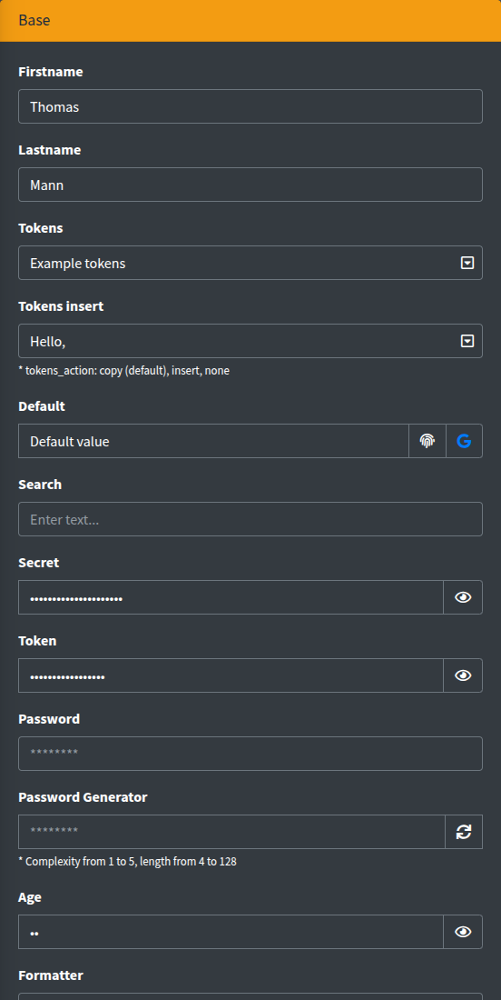

# text, number, email, url, search, password, secret

Single-line input. Seven components share one view, `lte3::components.text`, and differ only in the default `type` (and a few defaults) from the config.



## Signature

```php
Lte3::text(string $name, mixed $value = null, array $attrs = [])
Lte3::number(string $name, mixed $value = null, array $attrs = [])
Lte3::email(string $name, mixed $value = null, array $attrs = [])
Lte3::url(string $name, mixed $value = null, array $attrs = [])
Lte3::search(string $name, mixed $value = null, array $attrs = [])
Lte3::password(string $name, mixed $value = null, array $attrs = [])
Lte3::secret(string $name, mixed $value = null, array $attrs = [])
```

| Component | Config `default` |
| --- | --- |
| `text` | `['type' => 'text']` |
| `number` | `['type' => 'number', 'default' => 0]` |
| `email` | `['type' => 'email']` |
| `url` | `['type' => 'url']` |
| `search` | `['type' => 'search']` |
| `password` | `['type' => 'password']` |
| `secret` | `['type' => 'text', 'secret' => true]` |

The value is resolved as described in [Value resolution](overview.md#value-resolution): `old()`, request, `$value`, form model, `default`.

## Basic example

```blade
{!! Lte3::text('firstname', 'Thomas') !!}

{!! Lte3::text('lastname', 'Mann', [
    'readonly' => 1,
    'attrs' => ['custom-attrs' => 'custom-val'],
]) !!}

{!! Lte3::email('email', null, ['label' => 'Your Email', 'required' => true]) !!}

{!! Lte3::number('age', null, ['min' => 1, 'max' => 100]) !!}

{!! Lte3::search('search', null, ['placeholder' => 'Enter text...']) !!}
```

## Attrs

| Attr | Type | Default | Description |
| --- | --- | --- | --- |
| `type` | string | per component | Input `type`. Can be any HTML type, e.g. `Lte3::text('phone', null, ['type' => 'tel'])`. |
| `label` | string | `Str::studly($name)` | Label HTML. `''` hides it. |
| `help` | string | - | Help HTML under the field. |
| `class` | string | - | Extra classes of the `<input>`. |
| `class_wrap` | string | - | Extra classes of the wrapper `.form-group`. |
| `hidden_wrap` | bool | `false` | Hides the whole field (`hidden` on the wrapper). |
| `disabled` | bool | `false` | Adds `disabled`; the field is not submitted. |
| `readonly` | bool | `false` | Adds `readonly`. |
| `prepend` | string or array | - | HTML add-on(s) before the input, each in its own `.input-group-text`. |
| `append` | string or array | - | HTML add-on(s) after the input. |
| `secret` | bool | `false` (`true` for `secret`) | Masks the value with an eye toggle, see [Secret](#secret). |
| `tokens` | array | - | `[token => title]` list in a dropdown inside the field, see [Tokens](#tokens). |
| `tokens_action` | string | `copy` | `copy`, `insert` or `none`. |
| `checkbox` | array | - | Checkbox add-on at the end of the field, see [Checkbox add-on](#checkbox-add-on). |
| `attrs` | array | - | Arbitrary HTML attributes of the input. |
| `data` | array | - | `data-*` attributes of the input. |
| `default` | mixed | - (`0` for `number`) | Fallback value. |
| `formatter` | callable or class | - | Transforms the value before rendering, see [Formatter](overview.md#formatter). |

Keys from `lte3.view.field_attrs` (`placeholder`, `required`, `pattern`, `min`, `max`, `step`, `maxlength`, `autocomplete`, `id`, `title`, ...) are printed on the input; `false`/`null` ones are skipped. The input has `data-toggle="tooltip"`, so `title` is shown as a Bootstrap tooltip.

## Prepend and append

```blade
{!! Lte3::text('default', null, [
    'default' => 'Default value',
    'append' => [
        '<i class="fas fa-fingerprint"></i>',
        '<a href="https://www.google.com/" target="_blank"><i class="fab fa-google"></i></a>',
    ],
]) !!}

{!! Lte3::email('email', 'fom@app.com', [
    'prepend' => '<i class="fas fa-envelope"></i>',
    'append' => '<i class="fas fa-check"></i>',
]) !!}
```

Add-ons are printed as raw HTML. With any add-on the wrapper gets the `input-group` class.

## url

`Lte3::url()` always renders a link icon before the input. When the field has a value, the icon is a link to it that opens in a new tab.

```blade
{!! Lte3::url('url', null, ['default' => 'https://stackoverflow.com/']) !!}
```

## number

`type="number"` with `default` `0`, so a new form shows `0` instead of an empty field (inside a form with a model, the model value is used). Use `min`, `max` and `step` from `field_attrs`:

```blade
{!! Lte3::number('price', null, ['min' => 0, 'step' => '0.01', 'default' => null]) !!}
```

## password

The value is never printed: the input is always empty, including after a failed validation, and the placeholder defaults to `********`. Ignore an empty password on the server when the field is optional (e.g. on edit).

```blade
{!! Lte3::password('password') !!}
```

### Password generator

Put an element with the `js-passgen` class into an add-on. A click fills the field with a random password and switches it to `type="text"` so it is visible.

```blade
{!! Lte3::password('password_new', null, [
    'label' => 'Password Generator',
    'append' => '<i class="fas fa-sync js-passgen" data-complexity="4" data-length-from="8" data-length-to="16"></i>',
]) !!}
```

| Data attribute | Default | Description |
| --- | --- | --- |
| `data-complexity` | lowercase only | `1` lowercase letters, `2` + uppercase, `3` + digits, `4` + symbols. |
| `data-length-from` | `8` | Minimal length. |
| `data-length-to` | `8` | Maximal length; the length is random between the two. |
| `data-input-recipient` | - | Selector of the target input. Without it, the inputs in the closest `.form-group` are filled. |

The generator works with any text input, not only `password`.

## Secret

`Lte3::secret()`, or `'secret' => true` on any variant, renders the input as `type="password"` and appends an eye button. A click switches the input back to its original type (kept in `data-origin-type`) and back again.

```blade
{!! Lte3::secret('token', 'some-secret-token') !!}

{!! Lte3::text('secret', 'Some secret string :)', ['secret' => true]) !!}

{!! Lte3::number('pin', null, ['secret' => true]) !!}
```

Unlike `password`, the value is printed into the HTML and submitted as usual; it is only masked on screen.

> [!NOTE]
> The eye button handler is bound once on page load, so it does not work in secret fields inserted later (AJAX modals, repeater blocks).

## Tokens

`tokens` adds a dropdown button inside the field with a list of placeholders, e.g. for notification templates. Each item shows `title - token`.

```blade
{!! Lte3::text('subject', null, [
    'tokens' => ['[user:name]' => 'Name', '[user:phone]' => 'Phone'],
]) !!}

{!! Lte3::text('greeting', 'Hello, ', [
    'tokens' => ['[user:name]' => 'Name', '[user:phone]' => 'Phone'],
    'tokens_action' => 'insert',
]) !!}
```

| `tokens_action` | Click on an item |
| --- | --- |
| `copy` (default) | Copies the token to the clipboard (`.js-clipboard`) and shows a "Copied!" toastr. |
| `insert` | Inserts the token at the cursor (replacing the selection) and triggers `input` and `change` on the field. |
| `none` | Plain list, items are not clickable. |

## Checkbox add-on

`checkbox` appends a checkbox to the field. It is an independent form field with its own name:

```blade
{!! Lte3::email('email', 'fom@app.com', [
    'checkbox' => ['name' => 'verify', 'title' => 'Verify', 'value' => 0, 'readonly' => 1],
]) !!}
```

| Key | Description |
| --- | --- |
| `name` | Field name of the checkbox. |
| `title` | Tooltip (`title`) of the add-on. |
| `value` | Truthy value checks the box. |
| `readonly` | The box cannot be toggled (clicks are cancelled); it is still submitted. |
| `disabled` | Disables the box and its hidden input; nothing is submitted. |

A hidden input with `0` goes before the checkbox, so the server gets `verify=0` or `verify=1`. The `checkbox.value` is not resolved from `old()` or the form model; pass it yourself.

## Calculator input

The `js-input-calc` class turns the input into a simple calculator: only digits, `+ - * / ( ) .` and spaces can be typed, and on Enter or on blur the expression is replaced with its result. Enter does not submit the form.

```blade
{!! Lte3::text('amount', '3+4*2', ['class' => 'js-input-calc', 'help' => '* Press Enter for calc']) !!}
```

## Compare value

The `js-compare-value` class toggles elements depending on whether the field value equals `data-compare-value` (compared as trimmed strings), on page load and on every input.

```blade
{!! Lte3::text('sum', 42, [
    'class' => 'js-compare-value',
    'data' => [
        'compare-value' => 42,
        'compare-equal-target' => '.js-order-sum-equal',
        'compare-not-equal-target' => '.js-order-sum-not-equal',
    ],
]) !!}
<div class="callout callout-success js-order-sum-equal" style="display: none;">Value is equal 42</div>
<div class="callout callout-danger js-order-sum-not-equal" style="display: none;">Value is not equal 42</div>
```

## Pattern

`pattern` (in `field_attrs`) is printed on the input and checked live as the user types; the error text comes from `data-pattern-message` or the `lte3.view.pattern_validation.message` config. See [Pattern validation](../usage/pattern-validation.md).

```blade
{!! Lte3::text('phone', null, [
    'pattern' => '\+380\d{9}',
    'data' => ['pattern-message' => 'Format: +380XXXXXXXXX'],
]) !!}
```

## Submitted data

- `name` — the input value (nothing when `disabled`).
- `checkbox.name` — `0` or `1` when the [checkbox add-on](#checkbox-add-on) is used.

## Related

- [Fields overview](overview.md) — common attrs, value resolution, `field_attrs`.
- [textarea](textarea.md) — multi-line input with the same tokens dropdown.
- Config: `lte3.view.components.{text,number,email,url,search,password,secret}`, `lte3.view.field_attrs`, `lte3.view.pattern_validation`.
