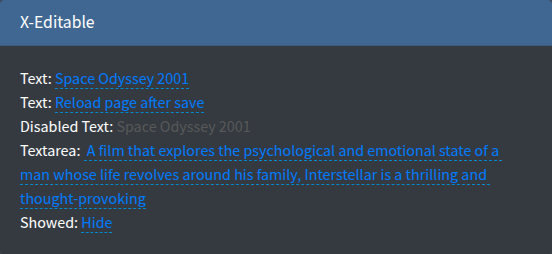

# xEditable

Inline editing of a single value with [X-editable](https://vitalets.github.io/x-editable/): the value is shown as a link, a click opens an input in place and the new value is saved by AJAX. Typical use is a cell in an index table.



## Signature

```php
Lte3::xEditable(string $name, mixed $value = null, array $attrs = [])
```

The value is resolved as described in [Value resolution](overview.md#value-resolution): `old()`, request, `$value`, form model, `default`.

## Basic example

```blade
@foreach($products as $product)
    <td>
        {!! Lte3::xEditable('name', $product->name, [
            'pk' => $product->id,
            'url_save' => route('admin.products.update-field'),
        ]) !!}
    </td>
@endforeach
```

```blade
{!! Lte3::xEditable('comment', $order->comment, [
    'type' => 'textarea',
    'pk' => $order->id,
    'limit_title' => 30,
    'url_save' => route('admin.orders.update-field'),
]) !!}

{!! Lte3::xEditable('visible', $page->visible, [
    'type' => 'select',
    'value_title' => $page->visible ? 'Show' : 'Hide',
    'source' => [['value' => '1', 'text' => 'Show'], ['value' => '0', 'text' => 'Hide']],
    'pk' => $page->id,
    'url_save' => route('admin.pages.update-field'),
]) !!}
```

## Attrs

| Attr | Type | Default | Description |
| --- | --- | --- | --- |
| `url_save` | string | - | URL the new value is sent to. Without it the value changes only on the page. |
| `pk` | mixed | random string | Primary key sent with the value, usually the record id. |
| `type` | string | `text` | X-editable input type: `text`, `textarea`, `select`, `checklist`, `number`, `email`, `url`, ... |
| `data_type` | string | - | Same as `type`, takes precedence over it. |
| `source` | array | - | Options for `select`/`checklist`: `[['value' => 1, 'text' => 'Show'], ...]` or `[1 => 'Show', 0 => 'Hide']`. JSON-encoded into `data-source`. |
| `value_title` | string | - | Text of the link instead of the raw value, e.g. the option text of a `select`. |
| `label` | string | - | Text of the link when both `value_title` and the value are `null`. Otherwise `[------]` is shown. |
| `limit_title` | int | - | Cuts the link text to this many characters (`Str::limit`). |
| `limit_end` | string | `...` | Ending appended by `limit_title`. |
| `viewformat` | string | - | X-editable `viewformat` for date types. |
| `disabled` | bool | `false` | Shows the value without editing. |
| `readonly` | bool | `false` | Same as `disabled`. |
| `class` | string | - | Extra classes of the link. |
| `class_wrap` | string | - | Also added to the link (there is no wrapper). |
| `attrs` | array | `[]` | Extra HTML attributes of the link, e.g. `data-*` options of X-editable. |

`field_attrs` keys (`title`, `id`, `style`, ...) are printed on the link. There is no label element, help text or validation error output.

## Endpoint

Request (X-editable default):

- Method: `POST` to `url_save`, AJAX with the CSRF header from the layout.
- Body: `name` (the field name), `value` (the new value; an array for `checklist`), `pk`.

Response:

```json
{"status": "ok", "message": "Saved", "_action": "reload"}
```

- `message` — shown as a toast: an error toast when `status` is `"error"`, a success toast otherwise.
- `_action: "reload"` — reloads the page after saving.
- Any 2xx response is treated as saved and the new value stays on the page, even with `status: "error"`. To reject a value, return an HTTP error status (e.g. `422`); X-editable keeps the input open and shows the response text under it.

```php
public function updateField(Request $request)
{
    $request->validate(['pk' => 'required|integer', 'name' => 'required|in:name,comment', 'value' => 'nullable|string|max:255']);

    Product::findOrFail($request->pk)->update([$request->name => $request->value]);

    return response()->json(['message' => 'Saved']);
}
```

> [!WARNING]
> Always whitelist `name` on the server: it comes from the browser and is used as a column name.

## JS behaviour

- Init: `$('.f-x-editable').editable({...})` in the package layout (`layouts/inc/options.blade.php`), once on page load, with `mode: 'inline'` and `inputclass: 'form-control-sm'`. It is not part of `Lte3.init()`, so links inserted later (modals, AJAX content) are not editable until you call `.editable()` on them.
- Data attributes on the link: `data-name`, `data-value`, `data-pk`, `data-type`, `data-url`, `data-source`, `data-viewformat`, `data-disabled`.

See [JavaScript API](../reference/javascript.md).

## Related

- [checkbox](checkbox.md) and [select2](select2.md) with `url_save` — AJAX save of a flag or a choice.
