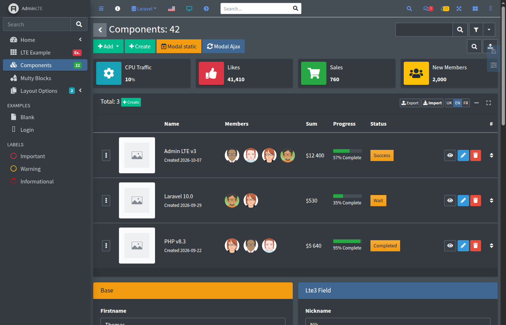

# Laravel LTE3

An admin panel for Laravel built on [AdminLTE 3](https://adminlte.io/themes/v3/) (Bootstrap 4, jQuery): a ready layout with navbar, sidebar, alerts and auth pages, and a Blade form builder with almost forty components — from text inputs to select2 with AJAX search, date pickers, file managers, Spatie Media Library uploads, trees and inline editing.



- **Fields in one line** — `{!! Lte3::text('title') !!}` renders a Bootstrap form group with label, value, validation error and help text
- **Value from everywhere** — `old()` input, the request, an explicit value, the bound form model or a default, in this order
- **AJAX out of the box** — autosave of select2, checkbox, colorpicker and x-editable, AJAX search and tags, tree selects, modals filled from the server
- **Files** — plain uploads, [Laravel File Manager](https://github.com/UniSharp/laravel-filemanager) picker with drag and drop, [Spatie Media Library](https://spatie.be/docs/laravel-medialibrary) field with previews, sorting, properties and a main file
- **Dynamic content** — fields in modals, repeaters and AJAX responses are initialized automatically
- **Layout** — light, dark and system theme, compact mode, filters, content header with breadcrumbs, toastr / sweetalert / Bootstrap alerts, pagination
- **Customizable** — every field is a Blade view: publish it, or register your own component in the config

## Quick example

```bash
composer require fomvasss/laravel-lte3
composer require almasaeed2010/adminlte
php artisan lte3:install
```

A page of the panel:

```blade
@extends('lte3::layouts.app')

@section('content')
    @include('lte3::parts.content-header', ['page_title' => 'Edit post'])

    <section class="content">
        <div class="card">
            <div class="card-body">
                {!! Lte3::formOpen(['action' => route('admin.posts.update', $post), 'method' => 'PUT', 'model' => $post]) !!}
                    {!! Lte3::text('title', null, ['required' => true]) !!}
                    {!! Lte3::select2('status', null, ['draft' => 'Draft', 'published' => 'Published']) !!}
                    {!! Lte3::datetimepicker('published_at') !!}
                    {!! Lte3::textarea('body', null, ['rows' => 8]) !!}
                    {!! Lte3::btnSubmit('Save') !!}
                {!! Lte3::formClose() !!}
            </div>
        </div>
    </section>
@endsection
```

`title`, `status`, `published_at` and `body` are filled from `$post`, and after a failed validation — from the old input.

Outside of `production` the package registers a demo at `/lte3`: dashboards, auth pages, all components at `/lte3/components` and block repeaters at `/lte3/mb-blocks`. Its source, [`resources/views/examples/components.blade.php`](https://github.com/fomvasss/laravel-lte3/blob/master/resources/views/examples/components.blade.php), is the most complete set of usage examples.

## Contents

Getting started

1. [Installation](installation.md)
2. [Configuration](configuration.md)

Usage

3. [Layout and pages](usage/layout.md)
4. [Forms](usage/forms.md)
5. [Back URL, modals and options](usage/request-options.md)
6. [Actions and AJAX](usage/actions.md)
7. [Dynamic content](usage/dynamic-content.md)
8. [Pattern validation](usage/pattern-validation.md)
9. [Block repeater (mb-blocks)](usage/mb-blocks.md)
10. [Editors and file manager](usage/editors.md)
11. [Media thumbnails](usage/media-thumbnails.md)

Fields

12. [Overview](fields/overview.md)
13. Inputs: [text, number, email, url, search, password, secret](fields/text.md), [textarea](fields/textarea.md), [slug](fields/slug.md), [hidden](fields/hidden.md), [colorpicker](fields/colorpicker.md), [range](fields/range.md)
14. Choice: [checkbox](fields/checkbox.md), [checkboxes](fields/checkboxes.md), [radiogroup](fields/radiogroup.md), [select2](fields/select2.md)
15. Trees: [select2Tree](fields/select2Tree.md), [treeview](fields/treeview.md), [nestedset](fields/nestedset.md)
16. Dates: [datepicker, timepicker, datetimepicker, multidatespicker](fields/datetime.md)
17. Files: [file](fields/file.md), [fileForm](fields/fileForm.md), [lfmFile, lfmImage](fields/lfmFile.md), [mediaFile, mediaImage](fields/mediaFile.md)
18. Lists and tables: [links](fields/links.md), [lists](fields/lists.md), [tableOptions](fields/tableOptions.md), [xEditable](fields/xEditable.md)
19. Form and buttons: [form](fields/form.md), [link, btnSubmit, btnReset, btnModalClose](fields/buttons.md)

Reference

20. [Lte3 facade](reference/facade.md)
21. [Helpers](reference/helpers.md)
22. [JavaScript API](reference/javascript.md)
23. [Views and publishing](reference/views.md)
24. [Artisan commands](reference/commands.md)
25. [Upgrading](upgrading.md)
